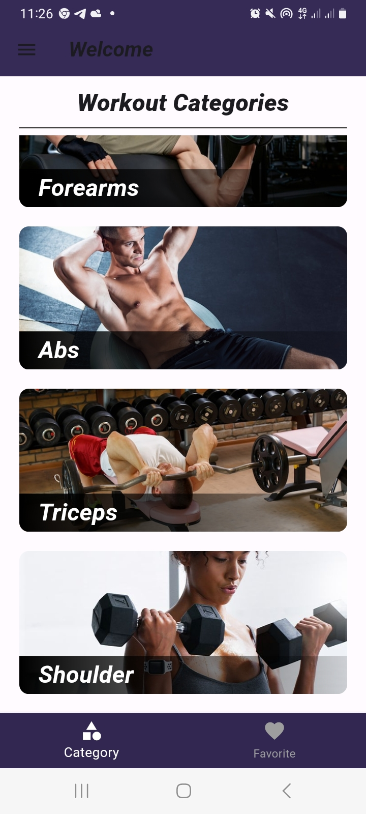

# Gym_guide_app

This is a flutter project i built. It is a gym guide app consisting of exercises, procedures for doing these exercises, BMI calculator, timer with music. The app also consists of how to use the application. 

## UI IMAGES

